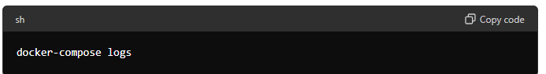

# Como usar

## Pré-requisitos

- [Docker](https://www.docker.com/)
- [Docker Compose](https://docs.docker.com/compose/)
- [.NET 8 SDK](https://dotnet.microsoft.com/download/dotnet/8.0)

## Configuração

1. **Clone o repositório:**

   ```sh
   git clone https://github.com/seu-usuario/cloudsuite-messaging-service.git
   cd cloudsuite-messaging-service





